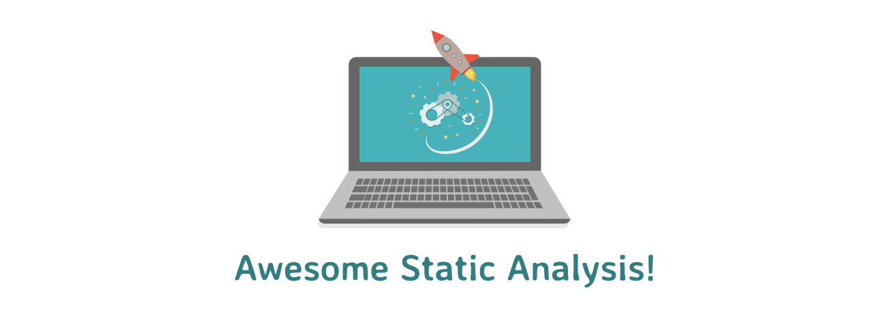

> Static program analysis is the analysis of computer software that is performed without actually executing programs — [Wikipedia](https://en.wikipedia.org/wiki/Static_program_analysis)

This is a collection of static analysis tools and code quality checkers. Pull requests are very welcome!

* :copyright: stands for proprietary software. All other tools are Open Source.
* :warning: indicates that the community does not recommend to use this tool for
  new projects anymore as it is outdated or no longer maintained.

Also check out the sister project, [awesome-dynamic-analysis](https://github.com/mre/awesome-dynamic-analysis).

# Table of Contents

#### [Programming Languages](#programming-languages-1)

 
Show languages

  <!-- Please use HTML syntax here so that it works for Github and mkdocs -->
  <ul>
    <li><a href="#abap">ABAP</a></li>
    <li><a href="#ada">Ada</a></li>
    <li><a href="#awk">Awk</a></li>
    <li><a href="#c">C</a></li>
    <li><a href="#cpp">C++</a></li>
    <li><a href="#csharp">C#</a></li>
    <li><a href="#crystal">Crystal</a></li>
    <li><a href="#dlang">Dlang</a></li>
    <li><a href="#delphi">Delphi</a></li>
    <li><a href="#elixir">Elixir</a></li>
    <li><a href="#elm">Elm</a></li>
    <li><a href="#erlang">Erlang</a></li>
    <li><a href="#fsharp">F#</a></li>
    <li><a href="#fortran">Fortran</a></li>
    <li><a href="#go">Go</a></li>
    <li><a href="#groovy">Groovy</a></li>
    <li><a href="#haskell">Haskell</a></li>
    <li><a href="#haxe">Haxe</a></li>
    <li><a href="#java">Java</a></li>
    <li><a href="#javascript">JavaScript</a></li>
    <li><a href="#kotlin">Kotlin</a></li>
    <li><a href="#lua">Lua</a></li>
    <li><a href="#matlab">MATLAB</a></li>
    <li><a href="#perl">Perl</a></li>
    <li><a href="#php">PHP</a></li>
    <li><a href="#python">Python</a></li>
    <li><a href="#pythonwrapper">Python wrappers</a></li>
    <li><a href="#r">R</a></li>
    <li><a href="#rpg">RPG</a></li>
    <li><a href="#ruby">Ruby</a></li>
    <li><a href="#rust">Rust</a></li>
    <li><a href="#scala">Scala</a></li>
    <li><a href="#shell">Shell</a></li>
    <li><a href="#solidity">Solidity</a></li>
    <li><a href="#sql">SQL</a></li>
    <li><a href="#swift">Swift</a></li>
    <li><a href="#tcl">Tcl</a></li>
    <li><a href="#typescript">TypeScript</a></li>
    <li><a href="#vbscript">VBScript</a></li>
    </ul>

#### [Multiple languages](#multiple-languages-1)

#### [Other](#other-1)

- [Android](#android)
- [Build tools](#buildtool)
- [Binaries](#binary)
- [More collections](#collection)
- [Compiler](#compiler)
- [Containers](#container)
- [Config Files](#configfile)
- [Configuration Management](#configmanagement)
- [CSS&#x2F;SASS&#x2F;SCSS](#css)
- [Gherkin](#gherkin)
- [Gradle](#gradle)
- [Haml](#haml)
- [HTML](#html)
- [HTML5](#html)
- [IDE Plugins](#ide)
- [LaTeX](#latex)
- [Less](#less)
- [Makefiles](#make)
- [Markdown](#markdown)
- [Mobile](#mobile)
- [Multiple Languages](#multi)
- [Node.js](#nodejs)
- [Packages](#package)
- [PhoneGap](#phonegap)
- [PowerShell](#powershell)
- [Protocol Buffers](#protobuf)
- [Supporting Tools](#support)
- [Template-Languages](#template)
- [Translation](#translation)
- [Visual Basic .NET](#vbnet)
- [Visual Basic](#vbasic)
- [Visualforce](#visualforce)
- [Vue.js](#vue)
- [Vyper (Smart contract)](#vyper)
- [Writing](#writing)
- [Web services](#service)
- [XML](#xml)

---

# Programming Languages

## ABAP

* [abaplint](https://github.com/larshp/abaplint) - Linter for ABAP, written in TypeScript.
* [abapOpenChecks](https://github.com/larshp/abapOpenChecks) - Enhances the SAP Code Inspector with new and customizable checks.

## Ada

* [Codepeer](http://www.adacore.com/codepeer) - detects run-time and logic errors
* [Polyspace for Ada](https://www.mathworks.com/products/polyspace-ada.html) :copyright: - provide code verification that proves the absence of overflow, divide-by-zero, out-of-bounds array access, and certain other run-time errors in source code.
* [SPARK](http://www.spark-2014.org/about) :copyright: - Static analysis and formal verification toolset for Ada
* [Understand](https://scitools.com/ada-programming-essential/) :copyright: - IDE that provides code analysis, standards testing, metrics, graphing, dependency analysis and more for Ada and VHDL.

## Awk

* [gawk --lint](https://www.gnu.org/software/gawk/manual/html_node/Options.html) - warns about constructs that are dubious or nonportable to other awk implementations.

## C

* [Astrée](https://www.absint.com/astree/index.htm) :copyright: - Sound static analyzer based on abstract interpretation for C/C++, detecting memory, type and concurrency defects, and MISRA violations.
* [CBMC](http://www.cprover.org/cbmc/) - bounded model-checker for C programs, user-defined assertions, standard assertions, several coverage metric analyses
* [clang-tidy](http://clang.llvm.org/extra/clang-tidy/) - clang static analyser
* [CMetrics](https://github.com/MetricsGrimoire/CMetrics) - Measures size and complexity for C files
* [Codecheker](https://github.com/Ericsson/codechecker) - static analysis of C/C++ code, with web GUI
* [CodeSonar from GrammaTech](https://www.grammatech.com/products/codesonar) :copyright: - Advanced, whole program, deep path, static analysis of C and C++ with easy-to-understand explanations and code and path visualization.
* [Corrode](https://github.com/jameysharp/corrode) - Semi-automatic translation from C to Rust. Could reveal bugs in the original implementation by showing Rust compiler warnings and errors.
* [cppcheck](https://github.com/danmar/cppcheck) - static analysis of C/C++ code
* [CppDepend](https://www.cppdepend.com) :warning: :copyright: - Measure, query and visualize your code and avoid unexpected issues, technical debt and complexity.
* [cpplint](https://github.com/google/styleguide/tree/gh-pages/cpplint) - automated C++ checker that follows Google's style guide
* [cqmetrics](https://github.com/dspinellis/cqmetrics) - quality metrics for C code
* [CScout](https://www.spinellis.gr/cscout/) - complexity and quality metrics for for C and C preprocessor code
* [flawfinder](http://www.dwheeler.com/flawfinder/) - finds possible security weaknesses
* [flint++](https://github.com/JossWhittle/FlintPlusPlus) - cross-platform, zero-dependency port of flint, a lint program for C++ developed and used at Facebook.
* [Frama-C](http://frama-c.com/) - a sound and extensible static analyzer for C code
* [Helix QAC](https://www.perforce.com/products/helix-qac) :copyright: - Enterprise-grade static analysis for embedded software. Supports MISRA, CERT, and AUTOSAR coding standards.
* [IKOS](https://github.com/nasa-sw-vnv/ikos) - a sound static analyzer for C/C++ code based on LLVM
* [include-gardener](https://github.com/feddischson/include_gardener) - a multi-language static analyzer for C/C++/Obj-C/Python/Ruby to create a graph (in dot or graphml format) which shows all `#include` relations of a given set of files.
* [LDRA](https://ldra.com) :copyright: - a tool suite including static analysis (TBVISION) to various standards including MISRA C & C++, JSF++ AV, CWE, CERT C, CERT C++ & Custom Rules.
* [oclint](http://oclint.org/) - static analysis of C/C++ code
* [Phasar](https://github.com/secure-software-engineering/phasar) - A LLVM-based static analysis framework which comes with a taint and type state analysis.
* [Polyspace Bug Finder](https://www.mathworks.com/products/polyspace-bug-finder.html) :copyright: - identifies run-time errors, concurrency issues, security vulnerabilities, and other defects in C and C++ embedded software.
* [Polyspace Code Prover](https://www.mathworks.com/products/polyspace-code-prover.html) :copyright: - provide code verification that proves the absence of overflow, divide-by-zero, out-of-bounds array access, and certain other run-time errors in C and C++ source code.
* [scan-build](https://clang-analyzer.llvm.org/scan-build.html) - Analyzes C/C++ code using LLVM at compile-time
* [splint](https://github.com/ravenexp/splint) - Annotation-assisted static program checker
* [SVF](https://github.com/SVF-tools/SVF) - a static tool that enables scalable and precise interprocedural dependence analysis for C and C++ programs.
* [vera++](https://bitbucket.org/verateam/vera/wiki/Introduction) - Vera++ is a programmable tool for verification, analysis and transformation of C++ source code.

## C#

* [.NET Analyzers](https://github.com/DotNetAnalyzers) - An organization for the development of analyzers (diagnostics and code fixes) using the .NET Compiler Platform.
* [Code Analysis Rule Collection](https://carc.codeplex.com/) - Contains a set of diagnostics, code fixes and refactorings built on the Microsoft .NET Compiler Platform "Roslyn".
* [code-cracker](https://github.com/code-cracker/code-cracker) - An analyzer library for C# and VB that uses Roslyn to produce refactorings, code analysis, and other niceties.
* [CodeRush](https://www.devexpress.com/products/coderush/) :copyright: - Code creation, debugging, navigation, refactoring, analysis and visualization tools that use the Roslyn engine in Visual Studio 2015 and up.
* [CSharpEssentials](https://github.com/DustinCampbell/CSharpEssentials) - C# Essentials is a collection of Roslyn diagnostic analyzers, code fixes and refactorings that make it easy to work with C# 6 language features.
* [Designite](http://www.designite-tools.com) :copyright: - Designite supports detection of various architecture, design, and implementation smells, computation of various code quality metrics, and trend analysis.
* [Gendarme](http://www.mono-project.com/docs/tools+libraries/tools/gendarme/) - Gendarme inspects programs and libraries that contain code in ECMA CIL format (Mono and .NET).
* [NDepend](http://www.ndepend.com/) :copyright: - Measure, query and visualize your code and avoid unexpected issues, technical debt and complexity.
* [Puma Scan](https://github.com/pumasecurity/puma-scan) - Puma Scan provides real time secure code analysis for common vulnerabilities (XSS, SQLi, CSRF, LDAPi, crypto, deserialization, etc.) as development teams write code in Visual Studio.
* [Refactoring Essentials](https://marketplace.visualstudio.com/items?itemName=SharpDevelopTeam.RefactoringEssentialsforVisualStudio) - The free Visual Studio 2015 extension for C# and VB.NET refactorings, including code best practice analyzers.
* [ReSharper](https://www.jetbrains.com/resharper/) :copyright: - Extends Visual Studio with on-the-fly code inspections for C#, VB.NET, ASP.NET, JavaScript, TypeScript and other technologies.
* [Roslyn Analyzers](https://github.com/dotnet/roslyn-analyzers) - Roslyn-based implementation of FxCop analyzers.
* [Roslyn Security Guard](https://dotnet-security-guard.github.io/) - Project that focuses on the identification of potential vulnerabilities such as SQL injection, cross-site scripting (XSS), CSRF, cryptography weaknesses, hardcoded passwords and many more.
* [Roslynator](https://github.com/JosefPihrt/Roslynator/) - A collection of 190+ analyzers and 190+ refactorings for C#, powered by Roslyn.
* [Security Code Scan](https://security-code-scan.github.io/) - Security code analyzer for C# and VB.NET. Detects various security vulnerability patterns: SQLi, XSS, CSRF, XXE, Open Redirect, etc.
* [SonarLint for Visual Studio](https://vs.sonarlint.org/) - SonarLint is an extension for Visual Studio 2015 and 2017 that provides on-the-fly feedback to developers on new bugs and quality issues injected into .NET code.
* [VSDiagnostics](https://github.com/Vannevelj/VSDiagnostics) - A collection of static analyzers based on Roslyn that integrates with VS.
* [Wintellect.Analyzers](https://github.com/Wintellect/Wintellect.Analyzers) - .NET Compiler Platform ("Roslyn") diagnostic analyzers and code fixes.

## C++

* [Astrée](https://www.absint.com/astree/index.htm) :copyright: - Sound static analyzer based on abstract interpretation for C/C++, detecting memory, type and concurrency defects, and MISRA violations.
* [CBMC](http://www.cprover.org/cbmc/) - bounded model-checker for C programs, user-defined assertions, standard assertions, several coverage metric analyses
* [clang-tidy](http://clang.llvm.org/extra/clang-tidy/) - clang static analyser
* [CMetrics](https://github.com/MetricsGrimoire/CMetrics) - Measures size and complexity for C files
* [Codecheker](https://github.com/Ericsson/codechecker) - static analysis of C/C++ code, with web GUI
* [CodeSonar from GrammaTech](https://www.grammatech.com/products/codesonar) :copyright: - Advanced, whole program, deep path, static analysis of C and C++ with easy-to-understand explanations and code and path visualization.
* [Corrode](https://github.com/jameysharp/corrode) - Semi-automatic translation from C to Rust. Could reveal bugs in the original implementation by showing Rust compiler warnings and errors.
* [cppcheck](https://github.com/danmar/cppcheck) - static analysis of C/C++ code
* [CppDepend](https://www.cppdepend.com) :warning: :copyright: - Measure, query and visualize your code and avoid unexpected issues, technical debt and complexity.
* [cpplint](https://github.com/google/styleguide/tree/gh-pages/cpplint) - automated C++ checker that follows Google's style guide
* [cqmetrics](https://github.com/dspinellis/cqmetrics) - quality metrics for C code
* [CScout](https://www.spinellis.gr/cscout/) - complexity and quality metrics for for C and C preprocessor code
* [flawfinder](http://www.dwheeler.com/flawfinder/) - finds possible security weaknesses
* [flint++](https://github.com/JossWhittle/FlintPlusPlus) - cross-platform, zero-dependency port of flint, a lint program for C++ developed and used at Facebook.
* [Frama-C](http://frama-c.com/) - a sound and extensible static analyzer for C code
* [Helix QAC](https://www.perforce.com/products/helix-qac) :copyright: - Enterprise-grade static analysis for embedded software. Supports MISRA, CERT, and AUTOSAR coding standards.
* [IKOS](https://github.com/nasa-sw-vnv/ikos) - a sound static analyzer for C/C++ code based on LLVM
* [include-gardener](https://github.com/feddischson/include_gardener) - a multi-language static analyzer for C/C++/Obj-C/Python/Ruby to create a graph (in dot or graphml format) which shows all `#include` relations of a given set of files.
* [LDRA](https://ldra.com) :copyright: - a tool suite including static analysis (TBVISION) to various standards including MISRA C & C++, JSF++ AV, CWE, CERT C, CERT C++ & Custom Rules.
* [oclint](http://oclint.org/) - static analysis of C/C++ code
* [Phasar](https://github.com/secure-software-engineering/phasar) - A LLVM-based static analysis framework which comes with a taint and type state analysis.
* [Polyspace Bug Finder](https://www.mathworks.com/products/polyspace-bug-finder.html) :copyright: - identifies run-time errors, concurrency issues, security vulnerabilities, and other defects in C and C++ embedded software.
* [Polyspace Code Prover](https://www.mathworks.com/products/polyspace-code-prover.html) :copyright: - provide code verification that proves the absence of overflow, divide-by-zero, out-of-bounds array access, and certain other run-time errors in C and C++ source code.
* [scan-build](https://clang-analyzer.llvm.org/scan-build.html) - Analyzes C/C++ code using LLVM at compile-time
* [splint](https://github.com/ravenexp/splint) - Annotation-assisted static program checker
* [SVF](https://github.com/SVF-tools/SVF) - a static tool that enables scalable and precise interprocedural dependence analysis for C and C++ programs.
* [vera++](https://bitbucket.org/verateam/vera/wiki/Introduction) - Vera++ is a programmable tool for verification, analysis and transformation of C++ source code.

## Crystal

* [ameba](https://github.com/veelenga/ameba) - A static code analysis tool for Crystal
* [crystal](https://crystal-lang.org/) - The Crystal compiler has built-in linting functionality.

## Delphi

* [Fix Insight](https://www.tmssoftware.com/site/fixinsight.asp) :copyright: - A free IDE Plugin for static code analysis. A _Pro_ edition includes a command line tool for automation purposes.
* [Pascal Analyzer](https://peganza.com/products_pal.html) :copyright: - A static code analysis tool with numerous reports. A free _Lite_ version is available with limited reporting.
* [Pascal Expert](https://peganza.com/products_pex.html) :copyright: - IDE plugin for code analysis. Includes a subset of Pascal Analyzer reporting capabilities and is available for Delphi versions 2007 and later.

## Dlang

* [D-scanner](https://github.com/dlang-community/D-Scanner) - D-Scanner is a tool for analyzing D source code

## Elixir

* [credo](https://github.com/rrrene/credo) - A static code analysis tool with a focus on code consistency and teaching.
* [sobelow](https://github.com/nccgroup/sobelow) - Security-focused static analysis for the Phoenix Framework

## Elm

* [elm-analyse](https://stil4m.github.io/elm-analyse/) - A tool that allows you to analyse your Elm code, identify deficiencies and apply best practices.

## Erlang

* [elvis](https://github.com/inaka/elvis) - Erlang Style Reviewer
* [Primitive Erlang Security Tool (PEST)](https://github.com/okeuday/pest) - A tool to do a basic scan of Erlang source code and report any function calls that may cause Erlang source code to be insecure.

## F#

* [FSharpLint](https://github.com/fsprojects/FSharpLint) - Lint tool for F#

## Fortran

* [i-Code CNES for Fortran](https://github.com/lequal/i-CodeCNES) - An open source static code analysis tool for Fortran 77, Fortran 90 and Shell.

## Go

* [aligncheck](https://gitlab.com/opennota/check) - Find inefficiently packed structs.
* [bodyclose](https://github.com/timakin/bodyclose) - Checks whether HTTP response body is closed.
* [deadcode](https://github.com/tsenart/deadcode) - Finds unused code.
* [dingo-hunter](https://github.com/nickng/dingo-hunter) - Static analyser for finding deadlocks in Go.
* [dogsled](https://github.com/alexkohler/dogsled) - Finds assignments/declarations with too many blank identifiers.
* [dupl](https://github.com/mibk/dupl) - Reports potentially duplicated code.
* [errcheck](https://github.com/kisielk/errcheck) - Check that error return values are used.
* [flen](https://github.com/lafolle/flen) - Get info on length of functions in a Go package.
* [gas](https://github.com/GoASTScanner/gas) - Inspects source code for security problems by scanning the Go AST.
* [Go Meta Linter](https://github.com/alecthomas/gometalinter) :warning: - Concurrently run Go lint tools and normalise their output. Use `golangci-lint` for new projects.
* [go tool vet --shadow](https://golang.org/cmd/vet/#hdr-Shadowed_variables) - Reports variables that may have been unintentionally shadowed.
* [go vet](https://golang.org/cmd/vet/) - Examines Go source code and reports suspicious.
* [go-consistent](https://github.com/Quasilyte/go-consistent) - Analyzer that helps you to make your Go programs more consistent.
* [go-critic](https://github.com/go-critic/go-critic) - Go source code linter that maintains checks which are currently not implemented in other linters.
* [go&#x2F;ast](https://golang.org/pkg/go/ast/) - Package ast declares the types used to represent syntax trees for Go packages.
* [gochecknoglobals](https://github.com/leighmcculloch/gochecknoglobals) - Checks that no globals are present.
* [goconst](https://github.com/jgautheron/goconst) - Finds repeated strings that could be replaced by a constant.
* [gocyclo](https://github.com/fzipp/gocyclo) - Calculate cyclomatic complexities of functions in Go source code.
* [gofmt -s](https://golang.org/cmd/gofmt/) - Checks if the code is properly formatted and could not be further simplified.
* [goimports](https://godoc.org/golang.org/x/tools/cmd/goimports) - Checks missing or unreferenced package imports.
* [GolangCI-Lint](https://github.com/golangci/golangci-lint) - Alternative to `Go Meta Linter`: GolangCI-Lint is a linters aggregator.
* [golint](https://github.com/golang/lint) - Prints out coding style mistakes in Go source code.
* [goreporter](https://github.com/360EntSecGroup-Skylar/goreporter) - concurrently runs many linters and normalises their output to a report.
* [goroutine-inspect](https://github.com/linuxerwang/goroutine-inspect) - An interactive tool to analyze Golang goroutine dump.
* [gosec (gas)](https://github.com/GoASTScanner/gas) - Inspects source code for security problems by scanning the Go AST.
* [gosimple](https://godoc.org/github.com/surullabs/lint/gosimple) - Simplifies code.
* [gotype](https://golang.org/x/tools/cmd/gotype) - Syntactic and semantic analysis similar to the Go compiler.
* [ineffassign](https://github.com/gordonklaus/ineffassign) - Detect ineffectual assignments in Go code
* [interfacer](https://github.com/mvdan/interfacer) - Suggest narrower interfaces that can be used.
* [lll](https://github.com/walle/lll) - Report long lines.
* [maligned](https://github.com/mdempsky/maligned) - Detect structs that would take less memory if their fields were sorted.
* [misspell](https://github.com/client9/misspell) - Finds commonly misspelled English words.
* [nakedret](https://github.com/alexkohler/nakedret) - Finds naked returns.
* [nargs](https://github.com/alexkohler/nargs) - Finds unused arguments in function declarations.
* [prealloc](https://github.com/alexkohler/prealloc) - Finds slice declarations that could potentially be preallocated.
* [revive](https://github.com/mgechev/revive) - Fast, configurable, extensible, flexible, and beautiful linter for Go. Drop-in replacement of golint.
* [safesql](https://github.com/stripe/safesql) - Static analysis tool for Golang that protects against SQL injections.
* [staticcheck](https://staticcheck.io/) - A suite of static analysis tools for Go, similar to ReSharper for C#. It specialises on bug finding, code simplicity, performance and editor integration.
* [structcheck](https://gitlab.com/opennota/check) - Find unused struct fields.
* [test](http://golang.org/pkg/testing/) - Show location of test failures from the stdlib testing module.
* [unconvert](https://github.com/mdempsky/unconvert) - Detect redundant type conversions.
* [unimport](https://github.com/alexkohler/unimport) - Finds unnecessary import aliases
* [unparam](https://github.com/mvdan/unparam) - Find unused function parameters.
* [unused](https://github.com/dominikh/go-tools/tree/master/unused) - Find unused variables.
* [varcheck](https://gitlab.com/opennota/check) - Find unused global variables and constants.
* [wsl](https://github.com/bombsimon/wsl) - Enforces empty lines at the right places.

## Groovy

* [CodeNarc](https://github.com/CodeNarc/CodeNarc) - a static analysis tool for Groovy source code, enabling monitoring and enforcement of many coding standards and best practices

## Haskell

* [HLint](https://github.com/ndmitchell/hlint) - HLint is a tool for suggesting possible improvements to Haskell code.
* [Weeder](https://github.com/ndmitchell/weeder) - A tool for detecting dead exports or package imports in Haskell code.

## Haxe

* [Haxe Checkstyle](https://github.com/HaxeCheckstyle/haxe-checkstyle) - A static analysis tool to help developers write Haxe code that adheres to a coding standard.

## Java

* [Checker Framework](https://github.com/typetools/checker-framework/) - Pluggable type-checking for Java http://checkerframework.org/
* [checkstyle](https://github.com/checkstyle/checkstyle) - checking Java source code for adherence to a Code Standard or set of validation rules (best practices)
* [ck](https://github.com/mauricioaniche/ck) - calculates Chidamber and Kemerer object-oriented metrics by processing the source Java files
* [ckjm](http://www.spinellis.gr/sw/ckjm/) - calculates Chidamber and Kemerer object-oriented metrics by processing the bytecode of compiled Java files
* [CogniCrypt](https://www.eclipse.org/cognicrypt/) - checks Java source and byte code for incorrect uses of cryptographic APIs
* [DesigniteJava](http://www.designite-tools.com/designitejava) :copyright: - DesigniteJava supports detection of various architecture, design, and implementation smells along with computation of various code quality metrics.
* [Error-prone](https://github.com/google/error-prone) - Catch common Java mistakes as compile-time errors
* [fb-contrib](https://github.com/mebigfatguy/fb-contrib) - A plugin for FindBugs with additional bug detectors
* [Find Security Bugs](https://find-sec-bugs.github.io/) - IDE/SonarQube plugin for security audits of Java web applications.
* [forbidden-apis](https://github.com/policeman-tools/forbidden-apis) - Detects and forbids invocations of specific method/class/field (like reading from a text stream without a charset). Maven/Gradle/Ant compatible.
* [google-java-format](https://github.com/google/google-java-format) - Google Style Reformat
* [Hopper](https://github.com/cuplv/hopper) - A static analysis tool written in scala for languages that run on JVM
* [HuntBugs](https://github.com/amaembo/huntbugs) :warning: - Bytecode static analyzer tool based on Procyon Compiler Tools aimed to supersede FindBugs.
* [JArchitect](https://www.jarchitect.com) :copyright: - Measure, query and visualize your code and avoid unexpected issues, technical debt and complexity.
* [JBMC](http://www.cprover.org/jbmc/) - bounded model-checker for Java (bytecode), verifies user-defined assertions, standard assertions, several coverage metric analyses
* [NullAway](https://github.com/uber/NullAway) - Type-based null-pointer checker with low build-time overhead; an [Error Prone](http://errorprone.info/) plugin
* [OWASP Dependency Check](https://owasp.org/www-project-dependency-check/) - Checks dependencies for known, publicly disclosed, vulnerabilities.
* [qulice](https://www.qulice.com/) - combines a few (pre-configured) static analysis tools (checkstyle, PMD, Findbugs, ...).
* [Soot](https://sable.github.io/soot/) - A framework for analyzing and transforming Java and Android applications.
* [Spoon](https://github.com/INRIA/spoon) - Library to write your own static analyses and architectural rule checkers for Java. Can be integrated in Maven and Gradle.
* [SpotBugs](https://spotbugs.github.io/) - SpotBugs is FindBugs' successor. A tool for static analysis to look for bugs in Java code.
* [Xanitizer](https://xanitizer.com/) - Xanitizer finds security vulnerabilities in Java/Scala web applications.

## JavaScript

* [aether](https://github.com/codecombat/aether) - Lint, analyze, normalize, transform, sandbox, run, step through, and visualize user JavaScript, in node or the browser.
* [Closure Compiler](https://github.com/google/closure-compiler) - A compiler tool to increase efficiency, reduce size, and provide code warnings in JavaScript files.
* [ClosureLinter](https://github.com/google/closure-linter) :warning: - ensures that all of your project's JavaScript code follows the guidelines in the Google JavaScript Style Guide. It can also automatically fix many common errors
* [coffeelint](https://github.com/clutchski/coffeelint) - A style checker that helps keep CoffeeScript code clean and consistent.
* [complexity-report](https://github.com/jared-stilwell/complexity-report) :warning: - Software complexity analysis for JavaScript projects
* [DeepScan](https://deepscan.io) :copyright: - An analyzer for JavaScript which targets runtime errors and quality issues rather than coding conventions.
* [escomplex](https://github.com/jared-stilwell/escomplex) - Software complexity analysis of JavaScript-family abstract syntax trees.
* [eslint](https://github.com/eslint/eslint) - A fully pluggable tool for identifying and reporting on patterns in JavaScript
* [Esprima](https://github.com/jquery/esprima) - ECMAScript parsing infrastructure for multipurpose analysis
* [flow](https://flow.org/) - A static type checker for JavaScript.
* [hegel](https://jsmonk.github.io/hegel) - A static type checker for JavaScript with a bias on type inference and strong type systems.
* [jshint](https://github.com/jshint/jshint) :warning: - detect errors and potential problems in JavaScript code and enforce your team's coding conventions
* [JSLint](https://github.com/douglascrockford/JSLint) :warning: - The JavaScript Code Quality Tool
* [JSPrime](https://github.com/dpnishant/jsprime) - static security analysis tool
* [NodeJSScan](https://github.com/ajinabraham/NodeJsScan) - NodeJsScan is a static security code scanner for Node.js applications.
* [plato](https://github.com/es-analysis/plato) - Visualize JavaScript source complexity
* [Prettier](https://github.com/prettier/prettier) - An opinionated code formatter.
* [quality](https://github.com/jden/quality) - zero configuration code and module linting
* [retire.js](https://github.com/RetireJS/retire.js) - Scanner detecting the use of JavaScript libraries with known vulnerabilities
* [standard](http://standardjs.com/) - An npm module that checks for Javascript Styleguide issues
* [tern](https://github.com/ternjs/tern) - A JavaScript code analyzer for deep, cross-editor language support
* [xo](https://github.com/xojs/xo) - Opinionated but configurable ESLint wrapper with lots of goodies included. Enforces strict and readable code.
* [yardstick](https://github.com/calmh/yardstick) :warning: - Javascript code metrics

## Kotlin

* [detekt](https://github.com/arturbosch/detekt) - Static code analysis for Kotlin code.
* [ktlint](https://github.com/shyiko/ktlint) - An anti-bikeshedding Kotlin linter with built-in formatter

## Lua

* [luacheck](https://github.com/mpeterv/luacheck) - A tool for linting and static analysis of Lua code.

## MATLAB

* [mlint](https://de.mathworks.com/help/matlab/ref/mlint.html) :copyright: - Check MATLAB code files for possible problems.

## PHP

* [dephpend](https://github.com/mihaeu/dephpend) - Dependency analysis tool
* [deprecation-detector](https://github.com/sensiolabs-de/deprecation-detector) - Finds usages of deprecated (Symfony) code
* [deptrac](https://github.com/sensiolabs-de/deptrac) - Enforce rules for dependencies between software layers.
* [DesignPatternDetector](https://github.com/Halleck45/DesignPatternDetector) - detection of design patterns in PHP code
* [EasyCodingStandard](https://github.com/Symplify/EasyCodingStandard) - combine [PHP_CodeSniffer](https://github.com/squizlabs/PHP_CodeSniffer) and [PHP-CS-Fixer](https://github.com/FriendsOfPHP/PHP-CS-Fixer)
* [exakat](https://github.com/exakat/exakat) - An automated code reviewing engine for PHP
* [GrumPHP](https://github.com/phpro/grumphp) - checks code on every commit
* [Mondrian](https://github.com/Trismegiste/Mondrian) - a set of static analysis and refactoring tools which use graph theory
* [parallel-lint](https://github.com/php-parallel-lint/PHP-Parallel-Lint) - This tool checks syntax of PHP files faster than serial check with a fancier output.
* [Parse](https://github.com/psecio/parse) - A Static Security Scanner
* [pdepend](https://pdepend.org/) - Calculates software metrics like cyclomatic complexity for PHP code.
* [phan](https://github.com/etsy/phan) - a modern static analyzer from etsy
* [PHP Architecture Tester](https://github.com/carlosas/phpat) - Easy to use architecture testing tool for PHP.
* [PHP Assumptions](https://github.com/rskuipers/php-assumptions) - Checks for weak assumptions
* [PHP Coding Standards Fixer](http://cs.sensiolabs.org/) - Fixes your code according to standards like PSR-1, PSR-2, and the Symfony standard.
* [Php Inspections (EA Extended)](https://github.com/kalessil/phpinspectionsea) - A Static Code Analyzer for PHP.
* [PHP Refactoring Browser](https://github.com/QafooLabs/php-refactoring-browser) - Refactoring helper
* [PHP Semantic Versioning Checker](https://github.com/tomzx/php-semver-checker) - Suggests a next version according to semantic versioning
* [PHP-Parser](https://github.com/nikic/PHP-Parser) - A PHP parser written in PHP
* [PHP-Token-Reflection](https://github.com/Andrewsville/PHP-Token-Reflection) - Library emulating the PHP internal reflection
* [php7cc](https://github.com/sstalle/php7cc) - PHP 7 Compatibility Checker
* [php7mar](https://github.com/Alexia/php7mar) - assist developers in porting their code quickly to PHP 7
* [PHP_CodeSniffer](https://github.com/squizlabs/PHP_CodeSniffer) - detects violations of a defined set of coding standards
* [phpca](https://github.com/wapmorgan/PhpCodeAnalyzer) - Finds usage of non-built-in extensions
* [phpcf](http://wapmorgan.github.io/PhpCodeFixer/) - Finds usage of deprecated PHP features
* [phpcpd](https://github.com/sebastianbergmann/phpcpd) - Copy/Paste Detector for PHP code.
* [phpdcd](https://github.com/sebastianbergmann/phpdcd) - Dead Code Detector (DCD) for PHP code.
* [PhpDependencyAnalysis](https://github.com/mamuz/PhpDependencyAnalysis) - builds a dependency graph for a project
* [phpdoc-to-typehint](https://github.com/dunglas/phpdoc-to-typehint) - Add scalar type hints and return types to existing PHP projects using PHPDoc annotations
* [phpDocumentor](https://www.phpdoc.org/) - Analyzes PHP source code to generate documentation
* [PHPMD](https://phpmd.org/) - finds possible bugs in your code
* [PhpMetrics](http://www.phpmetrics.org/) - Calculates and visualizes various code quality metrics
* [phpmnd](https://github.com/povils/phpmnd) - Helps to detect magic numbers
* [PHPQA](https://github.com/EdgedesignCZ/phpqa) - A tool for running QA tools (phploc, phpcpd, phpcs, pdepend, phpmd, phpmetrics)
* [phpqa - jakzal](https://github.com/jakzal/phpqa) - Many tools for PHP static analysis in one container
* [phpqa - jmolivas](https://github.com/jmolivas/phpqa) - PHPQA all-in-one Analyzer CLI tool
* [phpsa](https://github.com/ovr/phpsa) - Static analysis tool for PHP.
* [PHPStan](https://github.com/phpstan/phpstan) - PHP Static Analysis Tool - discover bugs in your code without running it!
* [Progpilot](https://github.com/designsecurity/progpilot) - A static analysis tool for security purposes
* [Psalm](https://getpsalm.org/) - Static analysis tool for finding type errors in PHP applications
* [Qafoo Quality Analyzer](https://github.com/Qafoo/QualityAnalyzer) - Visualizes metrics and source code
* [RIPS](https://www.ripstech.com/) :copyright: - A static source code analyser for vulnerabilities in PHP scripts
* [Tuli](https://github.com/ircmaxell/Tuli) - A static analysis engine
* [twig-lint](https://github.com/asm89/twig-lint) - twig-lint is a lint tool for your twig files.
* [WAP](https://securityonline.info/owasp-wap-web-application-protection-project/) - Tool to detect and correct input validation vulnerabilities in PHP (4.0 or higher) web applications and predicts false positives by combining static analysis and data mining.

## Perl

* [Perl::Critic](https://metacpan.org/pod/Perl::Critic) - Critique Perl source code for best-practices.

## Python

* [bandit](https://github.com/PyCQA/bandit) - a tool to find common security issues in Python code
* [bellybutton](https://github.com/hchasestevens/bellybutton) - a linting engine supporting custom project-specific rules
* [Black](https://github.com/ambv/black) - The uncompromising Python code formatter
* [cohesion](https://github.com/mschwager/cohesion) - a tool for measuring Python class cohesion
* [Dlint](https://github.com/dlint-py/dlint) - a tool for ensuring Python code is secure
* [include-gardener](https://github.com/feddischson/include_gardener) - a multi-language static analyzer for C/C++/Obj-C/Python/Ruby to create a graph (in dot or graphml format) which shows all `#include` relations of a given set of files.
* [jedi](https://github.com/davidhalter/jedi) - autocompletion/static analysis library for Python
* [linty fresh](https://github.com/lyft/linty_fresh) - parse lint errors and report them to Github as comments on a pull request
* [mccabe](https://github.com/PyCQA/mccabe) - check McCabe complexity
* [mypy](https://github.com/python/mypy) - a static type checker that aims to combine the benefits of duck typing and static typing, frequently used with [MonkeyType](https://github.com/Instagram/MonkeyType)
* [py-find-injection](https://github.com/uber/py-find-injection) - find SQL injection vulnerabilities in Python code
* [pycodestyle](https://github.com/PyCQA/pycodestyle) - (formerly `pep8`) check Python code against some of the style conventions in PEP 8
* [pydocstyle](https://github.com/PyCQA/pydocstyle) - check compliance with Python docstring conventions
* [pyflakes](https://github.com/pyflakes/pyflakes/) - check Python source files for errors
* [pylint](https://github.com/PyCQA/pylint) - looks for programming errors, helps enforcing a coding standard and sniffs for some code smells. It additionally includes `pyreverse` (an UML diagram generator) and `symilar` (a similarities checker).
* [pyre-check](https://github.com/facebook/pyre-check) - A fast, scalable type checker for large Python codebases
* [pyright](https://github.com/Microsoft/pyright) - Static type checker for Python, created to address gaps in existing tools like mypy.
* [pyroma](https://github.com/regebro/pyroma) - rate how well a Python project complies with the best practices of the Python packaging ecosystem, and list issues that could be improved
* [PyT - Python Taint](https://github.com/python-security/pyt) - A static analysis tool for detecting security vulnerabilities in Python web applications.
* [pytype](https://github.com/google/pytype) - A static type analyzer for Python code.
* [radon](https://github.com/rubik/radon) - a Python tool that computes various metrics from the source code
* [vulture](https://github.com/jendrikseipp/vulture) - find unused classes, functions and variables in Python code
* [wemake-python-styleguide](https://github.com/wemake-services/wemake-python-styleguide) - the strictest and most opinionated python linter ever
* [wily](https://github.com/tonybaloney/wily) - a command-line tool for archiving, exploring and graphing the complexity of Python source code
* [xenon](https://github.com/rubik/xenon) - monitor code complexity using [`radon`](https://github.com/rubik/radon)

## Python wrappers

* [ciocheck](https://github.com/ContinuumIO/ciocheck) - linter, formatter and test suite helper. As a linter, it is a wrapper around `pep8`, `pydocstyle`, `flake8`, and `pylint`.
* [flake8](https://github.com/PyCQA/flake8) - a wrapper around `pyflakes`, `pycodestyle` and `mccabe`
* [multilint](https://github.com/adamchainz/multilint) - a wrapper around `flake8`, `isort` and `modernize`
* [prospector](https://github.com/PyCQA/prospector) - a wrapper around `pylint`, `pep8`, `mccabe` and others

## R

* [cyclocomp](https://github.com/MangoTheCat/cyclocomp) - Quantifies the cyclomatic complexity of R functions / expressions.
* [goodpractice](http://mangothecat.github.io/goodpractice/) - Analyses the source code for R packages and provides best-practice recommendations.
* [lintr](https://github.com/jimhester/lintr) - Static Code Analysis for R.
* [styler](https://styler.r-lib.org/) - Formatting of R source code files and pretty-printing of R code.

## RPG

* [SourceMeter](https://www.sourcemeter.com/resources/rpg/) :copyright: - Static Code Analysis for RPG III and RPG IV versions (including free-form)

## Ruby

* [brakeman](https://github.com/presidentbeef/brakeman) - A static analysis security vulnerability scanner for Ruby on Rails applications
* [cane](https://github.com/square/cane) - Code quality threshold checking as part of your build
* [dawnscanner](https://github.com/thesp0nge/dawnscanner) - a static analysis security scanner for ruby written web applications. It supports Sinatra, Padrino and Ruby on Rails frameworks.
* [flay](https://github.com/seattlerb/flay) - Flay analyzes code for structural similarities.
* [flog](https://github.com/seattlerb/flog) - Flog reports the most tortured code in an easy to read pain report. The higher the score, the more pain the code is in.
* [include-gardener](https://github.com/feddischson/include_gardener) - a multi-language static analyzer for C/C++/Obj-C/Python/Ruby to create a graph (in dot or graphml format) which shows all `#include` relations of a given set of files.
* [laser](https://github.com/michaeledgar/laser) - Static analysis and style linter for Ruby code.
* [pelusa](https://github.com/codegram/pelusa) - Static analysis Lint-type tool to improve your OO Ruby code
* [quality](https://github.com/apiology/quality) - Runs quality checks on your code using community tools, and makes sure your numbers don't get any worse over time.
* [Querly](https://github.com/soutaro/querly) - Pattern Based Checking Tool for Ruby
* [Railroader](https://railroader.org/) - An open source static analysis security vulnerability scanner for Ruby on Rails applications.
* [reek](https://github.com/troessner/reek) - Code smell detector for Ruby
* [RuboCop](https://github.com/rubocop-hq/rubocop) - A Ruby static code analyzer, based on the community Ruby style guide.
* [Rubrowser](https://github.com/blazeeboy/rubrowser) - Ruby classes interactive dependency graph generator.
* [ruby-lint](https://github.com/YorickPeterse/ruby-lint) - Static code analysis for Ruby
* [rubycritic](https://github.com/whitesmith/rubycritic) - A Ruby code quality reporter
* [SandiMeter](https://github.com/makaroni4/sandi_meter) - Static analysis tool for checking Ruby code for Sandi Metz' rules.
* [Sorbet](https://github.com/sorbet/sorbet) - A fast, powerful type checker designed for Ruby

## Rust

* [cargo-audit](https://github.com/RustSec/cargo-audit) - Audit Cargo.lock for crates with security vulnerabilities reported to the [RustSec Advisory Database](https://github.com/RustSec/advisory-db/).
* [cargo-inspect](https://github.com/mre/cargo-inspect) - Inspect Rust code without syntactic sugar to see what the compiler does behind the curtains.
* [clippy](https://github.com/Manishearth/rust-clippy) - A code linter to catch common mistakes and improve your Rust code
* [electrolysis](https://github.com/Kha/electrolysis) - A tool for formally verifying Rust programs by transpiling them into definitions in the Lean theorem prover.
* [herbie](https://github.com/mcarton/rust-herbie-lint) - Adds warnings or errors to your crate when using a numerically unstable floating point expression.
* [linter-rust](https://github.com/AtomLinter/linter-rust) - Linting your Rust-files in Atom, using rustc and cargo
* [MIRAI](https://github.com/facebookexperimental/MIRAI) - And abstract interpreter operating on Rust's mid-level intermediate language, and providing warnings based on taint analysis.
* [Rust Language Server](https://github.com/rust-lang-nursery/rls) - Supports functionality such as 'goto definition', symbol search, reformatting, and code completion, and enables renaming and refactorings.
* [rustfix](https://github.com/killercup/rustfix) - read and apply the suggestions made by rustc (and third-party lints, like those offered by clippy).

## SQL

* [sqlcheck](https://github.com/jarulraj/sqlcheck-old) - Automatically identify anti-patterns in SQL queries
* [sqlint](https://github.com/purcell/sqlint) - Simple SQL linter
* [tsqllint](https://github.com/tsqllint/tsqllint) - T-SQL-specific linter
* [TSqlRules](https://github.com/ashleyglee/TSqlRules) - TSQL Static Code Analysis Rules for SQL Server

## Scala

* [linter](https://github.com/HairyFotr/linter) - Linter is a Scala static analysis compiler plugin which adds compile-time checks for various possible bugs, inefficiencies, and style problems.
* [Scalastyle](http://www.scalastyle.org) - Scalastyle examines your Scala code and indicates potential problems with it.
* [scapegoat](https://github.com/sksamuel/scapegoat) - Scala compiler plugin for static code analysis
* [WartRemover](https://github.com/puffnfresh/wartremover) - a flexible Scala code linting tool.
* [Xanitizer](https://xanitizer.com/) - Xanitizer finds security vulnerabilities in Java/Scala web applications.

## Shell

* [i-Code CNES for Shell](https://github.com/lequal/i-CodeCNES) - An open source static code analysis tool for Shell and Fortran (77 and 90).
* [shellcheck](https://github.com/koalaman/shellcheck) - ShellCheck, a static analysis tool that gives warnings and suggestions for bash/sh shell scripts

## Solidity

* [slither](https://github.com/trailofbits/slither) - Static analysis framework that runs a suite of vulnerability detectors, prints visual information about contract details, and provides an API to easily write custom analyses
* [solium](https://github.com/duaraghav8/Solium) - Solium is a linter to identify and fix style and security issues in Solidity smart contracts

## Swift

* [SwiftFormat](https://github.com/nicklockwood/SwiftFormat) - A library and command-line formatting tool for reformatting Swift code
* [SwiftLint](https://github.com/realm/SwiftLint) - A tool to enforce Swift style and conventions
* [Tailor](https://github.com/sleekbyte/tailor) :warning: - A static analysis and lint tool for source code written in Apple's Swift programming language.

## Tcl

* [Frink](https://catless.ncl.ac.uk/Programs/Frink/) - A Tcl formatting and static check program (can prettify the program, minimise, obfuscate or just sanity check it).
* [Nagelfar](https://sourceforge.net/projects/nagelfar/) - A static syntax checker for Tcl
* [tclchecker](https://github.com/ActiveState/tdk/blob/master/docs/3.0/TDK_3.0_Checker.txt) - A static syntax analysis module (as part of [TDK](https://github.com/ActiveState/tdk)).

## TypeScript

* [Codelyzer](https://github.com/mgechev/codelyzer) - A set of tslint rules for static code analysis of Angular 2 TypeScript projects.
* [ESLint](https://github.com/typescript-eslint/typescript-eslint) - An extensible linter for the TypeScript language.
* [tslint-clean-code](https://github.com/Glavin001/tslint-clean-code) - A set of TSLint rules inspired by the Clean Code handbook.
* [tslint-microsoft-contrib](https://github.com/Microsoft/tslint-microsoft-contrib) - A set of tslint rules for static code analysis of TypeScript projects maintained by Microsoft.

## VBScript

* [Test Design Studio](http://patterson-consulting.net/tds) :copyright: - A full IDE with static code analysis for Micro Focus Unified Functional Testing VBScript-based automated tests.

# Multiple languages

* [AppChecker](https://npo-echelon.ru/en/solutions/appchecker.php) :copyright: - Static analysis for C/C++/C#, PHP and Java
* [Application Inspector](https://www.ptsecurity.com/ww-en/products/ai/) :copyright: - Commercial Static Code Analysis which generates exploits to verify vulnerabilities. Supports: Java (including JSP and JSF), C#, VB.Net, ASP.NET, Php, JavaScript, Objective-C, Swift, C\C++, SQL (PL/SQL. T-SQL. MySQL), HTML5
* [ApplicationInspector](https://github.com/microsoft/ApplicationInspector) - creates reports of over 400 rule patterns for feature detection (e.g. the use of cryptography or version control in apps). Supports C/C++, C#, Java, JavaScript, HTML, Python, Objective-C, Go, Ruby, Powershell
* [AppScan Source](https://www.hcltechsw.com/wps/portal/products/appscan/home) :copyright: - Commercial Static Code Analysis. Supports: Microsoft .NET Framework (C#, ASP.NET, VB.NET), ASP (JavaScript/VBScript), C/C++, COBOL, ColdFusion, JavaScript, JavaServer Pages (JSP), Java™ (including support for Android APIs), Perl, PHP, PL/SQL, T-SQL, Visual Basic 6
* [APPscreener](https://solarappscreener.com/) :copyright: - Static code analysis for binary and source code - Java/Scala, PHP, Javascript, C#, PL/SQL, Python, T-SQL, C/C++, ObjectiveC/Swift, Visual Basic 6.0, Ruby, Delphi, ABAP, HTML5 and Solidity
* [ArchUnit](https://www.archunit.org/) - Unit test your Java or Kotlin architecture
* [Atom-Beautify](https://atom.io/packages/atom-beautify) - Beautify HTML, CSS, JavaScript, PHP, Python, Ruby, Java, C, C++, C#, Objective-C, CoffeeScript, TypeScript, Coldfusion, SQL, and more in Atom editor
* [Axivion Bauhaus Suite](https://www.axivion.com/en/products-services-9#products_bauhaussuite) :copyright: - Tracks down error-prone code locations, style violations, cloned or dead code, cyclic dependencies and more for C/C++, C#/.NET, Java and Ada 83/Ada 95
* [CAST Highlight](https://www.castsoftware.com/products/highlight) :copyright: - Commercial Static Code Analysis which runs locally, but uploads the results to its cloud for presentation. Supports: Java, JavaScript, Python, JSP, COBOL, SAP/Abap, C/C++, C#, PHP, Visual Basic, T-SQL, PL/SQL.
* [Checkmarx CxSAST](https://www.checkmarx.com/products/static-application-security-testing/) :copyright: - Commercial Static Code Analysis which doesn't require pre-compilation. Supports: Android (Java), Apex and VisualForce, ASP, C#, C/C++, Go, Groovy, HTML5, Java, JavaScript, Node.js, Objective C, Perl, PhoneGap, PHP, Python, Ruby, Scala, Swift, VB.NET, VB6, VBScript
* [ClassGraph](https://github.com/classgraph/classgraph) - a classpath and module path scanner for querying or visualizing class metadata or class relatedness. Supports JVM languages.
* [coala](https://coala.io/) - Language independent framework for creating code analysis - supports [over 60 languages](https://coala.io/languages) by default
* [Cobra](http://spinroot.com/cobra/) :copyright: - Structural source code analyzer by NASA's Jet Propulsion Laboratory. Supports C, C++, Ada, and Python.
* [codeburner](https://github.com/groupon/codeburner) - Provides a unified interface to sort and act on the issues it finds
* [CodeFactor](https://codefactor.io) :copyright: - Static Code Analysis for C#, C, C++, CoffeeScript, CSS, Groovy, GO, JAVA, JavaScript, Less, Python, Ruby, Scala, SCSS, TypeScript.
* [CodeIt.Right](https://submain.com/products/codeit.right.aspx) :copyright: - CodeIt.Right&trade; provides a fast, automated way to ensure that your source code adheres to (your) predefined design and style guidelines as well as best coding practices. Supported languages: C#, VB.NET.
* [CodeScene](https://empear.com/) :copyright: - CodeScene prioritizes technical debt, finds social patterns and identifies hidden risks in your code.
* [Coverity](https://www.synopsys.com/software-integrity/security-testing/static-analysis-sast.html) :copyright: - Synopsys Coverity supports 20 languages and over 70 frameworks including Ruby on rails, Scala, PHP, Python, JavaScript, TypeScript, Java, Fortran, C, C++, C#, VB.NET.
* [cqc](https://github.com/xcatliu/cqc) - Check your code quality for js, jsx, vue, css, less, scss, sass and styl files.
* [DeepCode](https://www.deepcode.ai/) :copyright: - DeepCode finds bugs, security vulnerabilities, performance and API issues based on AI. DeepCode's speed of analysis allow us to analyse your code in real time and deliver results when you hit the save button in your IDE. Supported languages are Java, C/C++, JavaScript, Python, and TypeScript. Integrations with GitHub, BitBucket and Gitlab.
* [DeepSource](https://deepsource.io/) :copyright: - In-depth static analysis to monitor source code quality and security. Supports Python and Go and can detect 600+ types of issues in verticals of bug risks, security, anti-patterns, performance, documentation and style. Native integration with GitHub.
* [Depends](https://github.com/multilang-depends/depends) - Analyses the comprehensive dependencies of code elements for Java, C/C++, Ruby.
* [DevSkim](https://github.com/microsoft/devskim) - Regex-based static analysis tool for Visual Studio, VS Code, and Sublime Text - C/C++, C#, PHP, ASP, Python, Ruby, Java, and others.
* [Fortify](https://software.microfocus.com/en-us/products/static-code-analysis-sast/overview) :copyright: - A commercial static analysis platform that supports the scanning of C/C++, C#, VB.NET, VB6, ABAP/BSP, ActionScript, Apex, ASP.NET, Classic ASP, VB Script, Cobol, ColdFusion, HTML, Java, JS, JSP, MXML/Flex, Objective-C, PHP, PL/SQL, T-SQL, Python (2.6, 2.7), Ruby (1.9.3), Swift, Scala, VB, and XML.
* [Goodcheck](https://github.com/sideci/goodcheck) - Regexp based customizable linter
* [graudit](https://github.com/wireghoul/graudit) - Grep rough audit - source code auditing tool - C/C++, PHP, ASP, C#, Java, Perl, Python, Ruby
* [Hound CI](https://houndci.com/) - Comments on style violations in GitHub pull requests. Supports Coffeescript, Go, HAML, JavaScript, Ruby, SCSS and Swift.
* [imhotep](https://github.com/justinabrahms/imhotep) - Comment on commits coming into your repository and check for syntactic errors and general lint warnings.
* [Infer](https://github.com/facebook/infer) - A static analyzer for Java, C and Objective-C
* [InsiderSec](https://github.com/insidersec/insider) - A open source Static Application Security Testing tool (SAST) written in GoLang for Java (Maven and Android), Kotlin (Android), Swift (iOS), .NET Full Framework, C# and Javascript (Node.js).
* [Kiuwan](https://www.kiuwan.com/code-security-sast/) :copyright: - Identify and remediate cyber threats in a blazingly fast, collaborative environment, with seamless integration in your SDLC. Python, C\C++, Java, C#, PHP and more
* [Klocwork](http://www.klocwork.com/products-services/klocwork) :copyright: - Quality and Security Static analysis for C/C++, Java and C#
* [oclint](https://github.com/oclint/oclint) - A static source code analysis tool to improve quality and reduce defects for C, C++ and Objective-C
* [pfff](https://github.com/facebook/pfff) - Facebook's tools for code analysis, visualizations, or style-preserving source transformation for many languages
* [PMD](https://pmd.github.io/) - A source code analyzer for Java, Javascript, PLSQL, XML, XSL and others
* [pre-commit](https://github.com/pre-commit/pre-commit) - A framework for managing and maintaining multi-language pre-commit hooks.
* [Pronto](https://github.com/prontolabs/pronto) - Quick automated code review of your changes. Supports more than 40 runners for various languages, including Clang, Elixir, JavaSCript, PHP, Ruby and more
* [PT.PM](https://github.com/PositiveTechnologies/PT.PM) - An engine for searching patterns in the source code, based on Unified AST or UST. At present time C#, Java, PHP, PL/SQL, T-SQL, and JavaScript are supported. Patterns can be described within the code or using a DSL.
* [PVS-Studio](https://www.viva64.com/en/pvs-studio/) :copyright: - a ([conditionally free](https://www.viva64.com/en/b/0614/) for FOSS and individual developers) static analysis of C, C++, C# and Java code. For advertising purposes [you can propose a large FOSS project for analysis by PVS employees](https://github.com/viva64/pvs-studio-check-list). Supports CWE mapping, MISRA and CERT coding standards.
* [Qualys Container Security](https://www.qualys.com/apps/container-security/) :copyright: - Container native application protection to provide visibility and control of containerized applications.
* [Reviewdog](https://github.com/haya14busa/reviewdog) - A tool for posting review comments from any linter in any code hosting service.
* [Security Code Scan](https://security-code-scan.github.io/) - Security code analyzer for C# and VB.NET. Detects various security vulnerability patterns: SQLi, XSS, CSRF, XXE, Open Redirect, etc.
* [Semmle QL and LGTM](https://semmle.com/) :copyright: - Find security vulnerabilities, variants, and critical code quality issues using queries over source code. Automatic PR code review; free for public GitHub/Bitbucket repo: [LGTM.com](https://LGTM.com).
* [shipshape](https://github.com/google/shipshape) - Static program analysis platform that allows custom analyzers to plug in through a common interface
* [SmartDec Scanner](https://smartdecscanner.com/) :copyright: - SAST tool which is capable of identifying vulnerabilities and undocumented features. The analyzer scans the source code and executables without debug info (i.e. binaries). Supports: Java/Scala/Kotlin, PHP, C#, JavaScript, TypeScript, VBScript, HTML5, Python, Perl, C/C++, Objective-C/Swift, PL/SQL, T-SQL, ABAP, 1C, Apex, Go, Ruby, Groovy, Delphi, VBA, Visual Basic 6, Solidity, Vyper, COBOL.
* [SonarQube](http://www.sonarqube.org/) - SonarQube is an open platform to manage code quality.
* [STOKE](https://github.com/StanfordPL/stoke) - a programming-language agnostic stochastic optimizer for the x86_64 instruction set. It uses random search to explore the extremely high-dimensional space of all possible program transformations
* [Synopsys](https://www.synopsys.com/software-integrity/security-testing/static-analysis-sast.html) :copyright: - A commercial static analysis platform that allows for scanning of multiple languages (C/C++, Android, C#, Java, JS, PHP, Python, Node.JS, Ruby, Fortran, and Swift)
* [TscanCode](https://github.com/Tencent/TscanCode) - A fast and accurate static analysis solution for C/C++, C#, Lua codes provided by Tencent. Using GPLv3 license.
* [Undebt](https://github.com/Yelp/undebt) - Language-independent tool for massive, automatic, programmable refactoring based on simple pattern definitions
* [Unibeautify](https://unibeautify.com/) - Universal code beautifier with a GitHub app. Supports HTML, CSS, JavaScript, TypeScript, JSX, Vue, C++, Go, Objective-C, Java, Python, PHP, GraphQL, Markdown, and more.
* [Veracode](http://www.veracode.com/products/static-analysis-sast/static-code-analysis) :copyright: - Find flaws in binaries and bytecode without requiring source. Support all major programming languages: Java, .NET, JavaScript, Swift, Objective-C, C, C++ and more.
* [WALA](http://wala.sourceforge.net/wiki/index.php/Main_Page) - static analysis capabilities for Java bytecode and related languages and for JavaScript
* [WhiteHat Application Security Platform](https://www.whitehatsec.com/products/static-application-security-testing/) :copyright: - WhiteHat Scout (for Developers) combined with WhiteHat Sentinel Source (for Operations) supporting WhiteHat Top 40 and OWASP Top 10. Language support for: Java, C#(.NET), ASP.NET, PHP, JavaScript, Node.js, Objective-C, Android, HTML5, TypeScript.
* [Wotan](https://github.com/fimbullinter/wotan) - Pluggable TypeScript and JavaScript linter
* [XCode](https://developer.apple.com/xcode/) :copyright: - XCode provides a pretty decent UI for [Clang's](http://clang-analyzer.llvm.org/xcode.html) static code analyzer (C/C++, Obj-C)

# Other

## Binaries

* [BinSkim](https://github.com/Microsoft/binskim) - A binary static analysis tool that provides security and correctness results for Windows portable executables.
* [cwe_checker](https://github.com/fkie-cad/cwe_checker) - cwe_checker finds vulnerable patterns in binary executables.
* [Jakstab](https://github.com/jkinder/jakstab) - Jakstab is an Abstract Interpretation-based, integrated disassembly and static analysis framework for designing analyses on executables and recovering reliable control flow graphs.
* [Manalyze](https://github.com/JusticeRage/Manalyze) - A static analyzer, which checks portable executables for malicious content.
* [Twiggy](https://github.com/rustwasm/twiggy) - Analyzes a binary's call graph to profile code size. The goal is to slim down binaries.

## Build tools

* [checkmake](https://github.com/mrtazz/checkmake) - Linter / Analyzer for Makefiles
* [codechecker](https://github.com/Ericsson/codechecker) - a defect database and viewer extension for the Clang Static Analyzer

## CSS&#x2F;SASS&#x2F;SCSS

* [CSS Stats](https://github.com/cssstats/cssstats) - Potentially interesting stats on stylesheets
* [CSScomb](https://github.com/csscomb/csscomb.js) - a coding style formatter for CSS. Supports own configurations to make style sheets beautiful and consistent
* [CSSLint](https://github.com/CSSLint/csslint) - Does basic syntax checking and finds problematic patterns or signs of inefficiency
* [GraphMyCSS.com](https://graphmycss.com) - CSS Specificity Graph Generator
* [Parker](https://github.com/katiefenn/parker) - Stylesheet analysis tool
* [Project Wallace CSS Analyzer](https://github.com/projectwallace/css-analyzer) - Analytics for CSS, part of [Project Wallace](https://www.projectwallace.com)
* [sass-lint](https://github.com/sasstools/sass-lint) - A Node-only Sass linter for both sass and scss syntax.
* [scsslint](https://github.com/brigade/scss-lint) - Linter for SCSS files
* [Specificity Graph](https://github.com/pocketjoso/specificity-graph) - CSS Specificity Graph Generator
* [Stylelint](http://stylelint.io/) - Linter for SCSS/CSS files

## Config Files

* [dotenv-linter](https://github.com/wemake-services/dotenv-linter) - Linting dotenv files like a charm.
* [gixy](https://github.com/yandex/gixy) - a tool to analyze Nginx configuration. The main goal is to prevent misconfiguration and automate flaw detection.

## Configuration Management

* [ansible-lint](https://github.com/willthames/ansible-lint) - Checks playbooks for practices and behaviour that could potentially be improved
* [cfn-lint](https://github.com/awslabs/cfn-python-lint) - AWS Labs CloudFormation linter.
* [cfn_nag](https://github.com/stelligent/cfn_nag) - A linter for AWS CloudFormation templates.
* [checkov](https://github.com/bridgecrewio/checkov/) - Static analysis tool for Terraform files (tf>=v0.12), preventing cloud misconfigs at build time.
* [cookstyle](https://docs.chef.io/cookstyle.html) - Cookstyle is a linting tool based on the RuboCop Ruby linting tool for Chef cookbooks
* [foodcritic](http://www.foodcritic.io/) - A lint tool that checks Chef cookbooks for common problems.
* [Puppet Lint](https://github.com/rodjek/puppet-lint) - Check that your Puppet manifests conform to the style guide.
* [terraform-compliance](https://terraform-compliance.com) - a lightweight, compliance and security focused, BDD test framework against Terraform.
* [terrascan](https://github.com/cesar-rodriguez/terrascan) - Collection of security and best practice tests for static code analysis of Terraform templates.
* [tflint](https://github.com/wata727/tflint) - A Terraform linter for detecting errors that can not be detected by `terraform plan`.

## Containers

* [anchore](https://anchore.io/) - Discover, analyze, and certify container images
* [clair](https://github.com/coreos/clair) - Vulnerability Static Analysis for Containers
* [collector](https://github.com/banyanops/collector) - Run arbitrary scripts inside containers, and gather useful information
* [dagda](https://github.com/eliasgranderubio/dagda) - Perform static analysis of known vulnerabilities in docker images/containers.
* [Docker Label Inspector](https://github.com/garethr/docker-label-inspector) - Lint and validate Dockerfile labels
* [Haskell Dockerfile Linter](https://github.com/lukasmartinelli/hadolint) - A smarter Dockerfile linter that helpsyou build best practice Docker images
* [kube-score](https://github.com/zegl/kube-score) - Static code analysis of your Kubernetes object definitions.

## Gherkin

* [gherkin-lint](https://github.com/vsiakka/gherkin-lint) - A linter for the Gherkin-Syntax written in Javascript.

## HTML

* [HTML Inspector](https://github.com/philipwalton/html-inspector) - HTML Inspector is a code quality tool to help you and your team write better markup.
* [HTML Tidy](http://www.html-tidy.org/) - Corrects and cleans up HTML and XML documents by fixing markup errors and upgrading legacy code to modern standards.
* [HTMLHint](https://github.com/yaniswang/HTMLHint) - A Static Code Analysis Tool for HTML
* [Polymer-analyzer](https://github.com/Polymer/polymer-analyzer) - A static analysis framework for Web Components.

## HTML5

* [HTML Inspector](https://github.com/philipwalton/html-inspector) - HTML Inspector is a code quality tool to help you and your team write better markup.
* [HTML Tidy](http://www.html-tidy.org/) - Corrects and cleans up HTML and XML documents by fixing markup errors and upgrading legacy code to modern standards.
* [HTMLHint](https://github.com/yaniswang/HTMLHint) - A Static Code Analysis Tool for HTML
* [Polymer-analyzer](https://github.com/Polymer/polymer-analyzer) - A static analysis framework for Web Components.

## IDE Plugins

* [ale](https://github.com/w0rp/ale) - Asynchronous Lint Engine for Vim and NeoVim with support for many languages
* [Android Studio](https://developer.android.com/studio) - Based on IntelliJ IDEA, and comes bundled with tools for Android including Android Lint.
* [Attackflow Extension](https://www.attackflow.com/Extension) - Attackflow plugin for Visual Studio, which enables developers to find critical security bugs at real time in the source code without any prior knowledge.
* [DevSkim](https://github.com/Microsoft/DevSkim) - Inline, realtime security analysis. Works with multiple programming languages and IDEs (VS, VS Code, Sublime Text, ...).
* [IntelliJ IDEA](https://www.jetbrains.com/idea/) - Comes bundled with a lot of inspections for Java and Kotlin and includes tools for refactoring, formatting and more.
* [Puma Scan](https://github.com/pumasecurity/puma-scan) - Puma Scan provides real time secure code analysis for common vulnerabilities (XSS, SQLi, CSRF, LDAPi, crypto, deserialization, etc.) as development teams write code in Visual Studio.
* [Security Code Scan](https://security-code-scan.github.io/) - Security code analyzer for C# and VB.NET that integrates into Visual Studio 2015 and newer. Detects various security vulnerability patterns: SQLi, XSS, CSRF, XXE, Open Redirect, etc.
* [vint](https://github.com/Kuniwak/vint) - Fast and Highly Extensible Vim script Language Lint implemented by Python.

## LaTeX

* [ChkTeX](http://www.nongnu.org/chktex/) - A linter for LaTex which catches some typographic errors LaTeX oversees.
* [lacheck](https://www.ctan.org/pkg/lacheck) - A tool for finding common mistakes in LaTeX documents.

## Makefiles

* [portlint](https://www.freebsd.org/cgi/man.cgi?query=portlint&sektion=1&manpath=FreeBSD+8.1-RELEASE+and+Ports) - A verifier for FreeBSD and DragonFlyBSD port directories.

## Markdown

* [markdownlint](https://github.com/DavidAnson/markdownlint) - Node.js -based style checker and lint tool for Markdown/CommonMark files.
* [mdl](https://github.com/mivok/markdownlint) - A tool to check Markdown files and flag style issues.
* [remark-lint](https://github.com/remarkjs/remark-lint) - Pluggable Markdown code style linter written in JavaScript.

## Mobile

* [Android Lint](http://tools.android.com/tips/lint) - Run static analysis on Android projects.
* [android-lint-summary](https://github.com/passy/android-lint-summary) - Combines lint errors of multiple projects into one output, check lint results of multiple sub-projects at once.
* [FlowDroid](https://github.com/secure-software-engineering/soot-infoflow-android) - static taint analysis tool for Android applications
* [paprika](https://github.com/GeoffreyHecht/paprika) - A toolkit to detect some code smells in analyzed Android applications.
* [qark](https://github.com/linkedin/qark) - Tool to look for several security related Android application vulnerabilities

## Packages

* [lintian](https://github.com/Debian/lintian) - Static analysis tool for Debian packages
* [rpmlint](https://github.com/rpm-software-management/rpmlint) - Tool for checking common errors in rpm packages

## Protocol Buffers

* [protolint](https://github.com/yoheimuta/protolint) - Pluggable linter and fixer to enforce Protocol Buffer style and conventions.

## Supporting Tools

* [LibVCS4j](https://github.com/uni-bremen-agst/libvcs4j) - A Java library that allows existing tools to analyse the evolution of software systems by providing a common API for different version control systems and issue trackers.
* [Violations Lib](https://github.com/tomasbjerre/violations-lib) - Java library for parsing report files from static code analysis. Used by a bunch of Jenkins, Maven and Gradle plugins.

## Template-Languages

* [ember-template-lint](https://github.com/rwjblue/ember-template-lint) - Linter for Ember or Handlebars templates.
* [haml-lint](https://github.com/brigade/haml-lint) - Tool for writing clean and consistent HAML
* [slim-lint](https://github.com/sds/slim-lint) - Configurable tool for analyzing Slim templates
* [yamllint](https://github.com/adrienverge/yamllint) - Checks YAML files for syntax validity, key repetition and cosmetic problems such as lines length, trailing spaces, and indentation.

## Translation

* [dennis](https://github.com/willkg/dennis/) - A set of utilities for working with PO files to ease development and improve quality.

## Web services

* [Codacy](https://www.codacy.com/) - Code Analysis to ship Better Code, Faster.
* [Code Climate](https://codeclimate.com/) - The open and extensible static analysis platform, for everyone.
* [Code Inspector](https://www.code-inspector.com) - Code quality and technical debt management platform that supports 10+ languages.
* [Codeac](https://www.codeac.io?ref=awesome-static-analysis) - Automated code review tool integrates with GitHub, Bitbucket and GitLab (even self-hosted). Available for JavaScript, TypeScript, Python, Ruby, Go, PHP, Java, Docker, and more. (open-source free)
* [CodeFactor](https://codefactor.io) - Automated Code Analysis for repos on GitHub or BitBucket.
* [CodeFlow](https://www.getcodeflow.com) - Automated code analysis tool to deal with technical depth. Integrates with Bitbucket and Gitlab. (free for Open Source Projects)
* [CodePatrol](https://cyber-security.claranet.fr/en/codepatrol) - Automated SAST code reviews driven by security, supports 15+ languages and includes security training.
* [Embold](https://embold.io) - Intelligent software analytics platform that identifies design issues, code issues, duplication and metrics. Supports Java, C, C++, C#, JavaScript, TypeScript, Python, Go, Kotlin and more.
* [kiuwan](https://www.kiuwan.com/) - Software Analytics in the Cloud supporting more than 22 programming languages.
* [Landscape](https://landscape.io/) - Static code analysis for Python
* [LGTM.com](https://lgtm.com/) - Deep code analysis for GitHub and Bitbucket to find security vulnerabilities and critical code quality issues (using Semmle QL). Automatic code review for pull requests; free for public repositories.
* [Nitpick CI](https://nitpick-ci.com) - Automated PHP code review
* [PullRequest](https://www.pullrequest.com) - Code review as a service with built-in static analysis
* [QuantifiedCode](https://www.quantifiedcode.com/) - Automated code review & repair
* [Reshift](https://softwaresecured.com/reshift/) - A source code analysis tool for detecting and managing Java security vulnerabilities.
* [Scrutinizer](https://scrutinizer-ci.com/) - A proprietary code quality checker that can be integrated with GitHub
* [SensioLabs Insight](https://insight.sensiolabs.com/) - Detect security risks, find bugs and provide actionable metrics for PHP projects
* [Sider](https://sider.review) - An automated code reviewing tool. Improving developers' productivity.
* [Snyk](https://snyk.io/) - Vulnerability scanner for dependencies of node.js apps (free for Open Source Projects)
* [SonarCloud](https://sonarcloud.io) - Multilanguage cloud-based static code analysis. History, trends, security hot-spots, pull request analysis and more. Free for open source.
* [Teamscale](http://www.teamscale.com/) - Static and dynamic analysis tool supporting more than 25 languages and direct IDE integration. Free hosting for Open Source projects available on request. Free academic licenses available.
* [Upsource](https://www.jetbrains.com/upsource/) - Code review tool with static code analysis and code-aware navigation for Java, PHP, JavaScript and Kotlin.

## Writing

* [After the Deadline](https://afterthedeadline.com/) - spell, style and grammar checker
* [codespell](https://github.com/codespell-project/codespell) - check code for common misspellings
* [languagetool](https://github.com/languagetool-org/languagetool) - Style and grammar checker for 25+ languages. It finds many errors that a simple spell checker cannot detect.
* [misspell-fixer](https://github.com/vlajos/misspell-fixer) - Quick tool for fixing common misspellings, typos in source code
* [Misspelled Words In Context](https://github.com/jwilk/mwic) - a spell-checker that groups possible misspellings and shows them in their contexts
* [proselint](https://github.com/amperser/proselint/) - a linter for English prose with a focus on writing style instead of grammar.
* [vale](https://github.com/ValeLint/vale) - A customizable, syntax-aware linter for prose.
* [write-good](https://github.com/btford/write-good) - A linter with a focus on eliminating "weasel words".

# More collections

* [go-tools](https://github.com/dominikh/go-tools) - A collection of tools and libraries for working with Go code, including linters and static analysis
* [linters](https://github.com/mcandre/linters) - An introduction to static code analysis
* [php-static-analysis-tools](https://github.com/exakat/php-static-analysis-tools) -  A reviewed list of useful PHP static analysis tools
* [Tools for C/C++](https://www.peerlyst.com/posts/a-list-of-static-analysis-tools-for-c-c-peerlyst?utm_source=twitter&utm_medium=social&utm_content=peerlyst_post&utm_campaign=peerlyst_resources) - A list of static analysis tools for C/C++
* [Wikipedia](http://en.wikipedia.org/wiki/List_of_tools_for_static_code_analysis) -  A list of tools for static code analysis.

## License

To the extent possible under law, [Matthias Endler](https://endler.dev) has waived all copyright and related or neighboring rights to this work.
Title image [Designed by Freepik](http://www.freepik.com).
